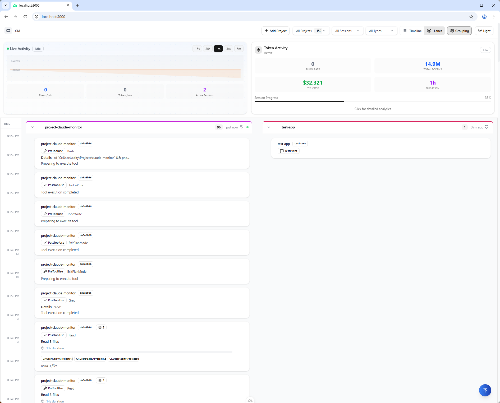
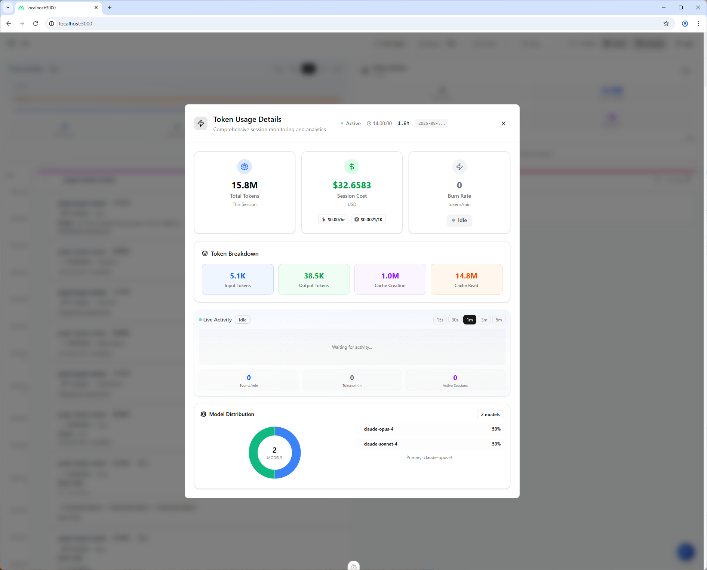
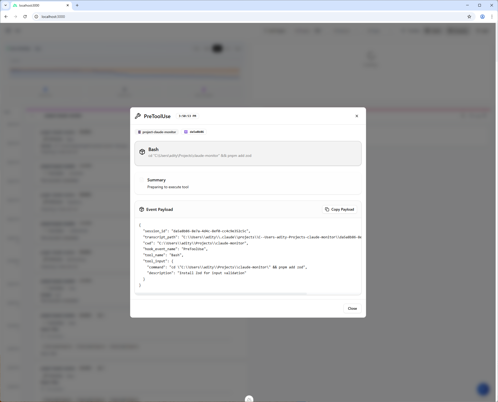

# Claude Monitor

A comprehensive real-time monitoring dashboard for tracking Claude Code usage, tool usage, token consumption, and session analytics. The goal is to make it easy to see your usage and add some traceability to Claude code so you can debug claude code agents and usage more effectively. It's built on the amazing work by @disler and @ryoppippi.

This is in active development and something I made for myself, I make no guarantees that it will work for everyone and that it won't set your machine on fire. Use at your own risk. 

## 🙏 Credits

This aggregates a few ideas from the community for an easy to use monitoring solution so you can track your CC usage. Shoutout to @disler and @ryoppippi for their projects and work on which this is built. 

- **Claude Code Hook Scripts** - Python hook implementations from [claude-code-hooks-multi-agent-observability](https://github.com/disler/claude-code-hooks-multi-agent-observability) by [@disler](https://github.com/disler)
- **CCUsage** - Claude Code usage tracking library from [ccusage](https://github.com/ryoppippi/ccusage) by [@ryoppippi](https://github.com/ryoppippi)

Special thanks to the contributors of these projects for providing the foundation that makes Claude Monitor possible.



## ✨ Features

### 📊 Real-Time Monitoring
- **Live Activity Feed**: Monitor tool usage, token consumption, and session events in real-time
- **WebSocket Integration**: Instant updates without page refreshes
- **Event Timeline**: Unified timeline view of all Claude Code activities
- **Swimlane View**: Organized project-based event lanes for better visualization

### 🎯 Token Usage Analytics
- **Comprehensive Token Tracking**: Input, output, cache read, and cache creation tokens
- **Cost Analysis**: Real-time cost calculations with breakdown by token type
- **Session-based Metrics**: Track token usage across different Claude Code sessions
- **Model Distribution**: Visual breakdown of usage across different Claude models (GPT-4, Sonnet-4, etc.)



### 🔍 Advanced Filtering & Grouping
- **Multi-level Filtering**: Filter by project, session, and event type
- **Smart Grouping**: Automatically group similar events to reduce noise
- **Project Management**: Easy project identification and organization
- **Event Type Categorization**: PreToolUse, PostToolUse, Stop, UserPromptSubmit, and more

### 🎨 Modern UI/UX
- **Dark/Light/Auto Theme**: Adaptive theming with system preference detection
- **Responsive Design**: Works seamlessly on desktop and mobile devices
- **Live Pulse Indicators**: Visual activity indicators showing system health
- **Collapsible Event Details**: Expandable event payloads with syntax highlighting



### 🛠️ Easy Integration
- **One-Click Hook Installation**: Automatic Claude Code hook setup
- **Project Auto-Discovery**: Automatically detects and configures Claude Code projects
- **SQLite Database**: Local storage with no external dependencies
- **Environment Variables**: Flexible configuration options

## 🚀 Quick Start

### Prerequisites
- Node.js (v18 or higher)
- pnpm (recommended) or npm

### Installation

1. **Clone the repository**
   ```bash
   git clone <repository-url>
   cd claude-monitor
   ```

2. **Install dependencies**
   ```bash
   pnpm install
   ```

3. **Start the development server**
   ```bash
   pnpm dev
   ```

4. **Access the dashboard**
   Open [http://localhost:3000](http://localhost:3000) in your browser

### Adding Projects to Monitor

1. Click the **"Add Project"** button in the top navigation
2. Select your Claude Code project directory
3. Enter a display name for easy identification
4. The system will automatically:
   - Install monitoring hooks in your project's `.claude` directory
   - Configure the necessary environment variables
   - Start tracking all Claude Code activities

## 📚 Documentation

- **[Architecture](ARCHITECTURE.md)** - Detailed system architecture, tech stack, and project structure
- **[Configuration](CONFIGURATION.md)** - Environment variables, hook setup, and customization options

## 📈 Usage Analytics

### Token Metrics Tracked
- **Input Tokens**: User prompts and context
- **Output Tokens**: Claude's responses
- **Cache Read**: Cached content retrieval
- **Cache Creation**: New cache entries

### Cost Calculations
Automatically calculates costs based on current Claude API pricing:
- Input: $0.003 per 1K tokens
- Output: $0.015 per 1K tokens
- Cache operations tracked separately

### Session Management
- Tracks multiple concurrent Claude Code sessions
- Session-based filtering and analytics
- Historical data retention

## 🔧 Development

### Scripts
```bash
# Development
pnpm dev              # Start dev server
pnpm build            # Build for production
pnpm preview          # Preview production build
pnpm type-check       # Run TypeScript checks

# Testing
pnpm test             # Run tests (if configured)
```

### Database Schema
The monitor uses SQLite with the following main tables:
- `events`: All Claude Code events and activities
- `themes`: User theme preferences
- Additional tables for session and usage tracking

## 🤝 Contributing

1. Fork the repository
2. Create a feature branch: `git checkout -b feature/amazing-feature`
3. Commit changes: `git commit -m 'Add amazing feature'`
4. Push to branch: `git push origin feature/amazing-feature`
5. Open a Pull Request

## 📄 License

This project is licensed under the MIT License - see the LICENSE file for details.

## 🐛 Issues & Support

If you encounter any issues or have feature requests, please:
1. Check existing issues in the repository
2. Create a new issue with detailed information
3. Include screenshots if UI-related

## 🚧 Roadmap

- [ ] Multi machine observation, monitoring, and data aggregation


---

**Note**: This tool is designed to work with Claude Code and requires proper hook installation in your Claude Code projects for full functionality.